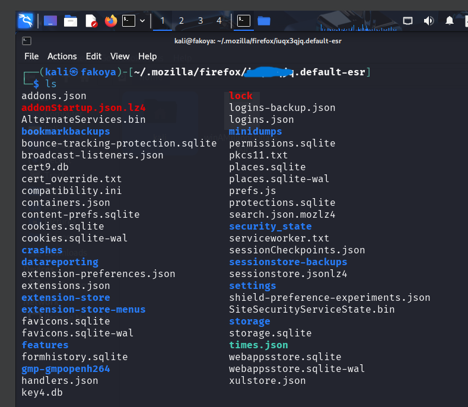

# Project: Digital Forensics Web History Analysis with Autopsy

## Overview
This project demonstrates comprehensive web history forensic analysis using Autopsy to investigate browser artifacts, internet activity patterns, email addresses, IPs and user behavior through Mozilla Firefox profile examination. The implementation focuses on extracting and analyzing browsing history from SQLite databases for investigative purposes.

---

## Organizational Application

### Importance to Companies
Web history analysis is critical for organizations to investigate policy violations, unauthorized internet usage, and potential security breaches. Understanding employee internet activity patterns helps maintain productivity, protect company resources, and ensure compliance with acceptable use policies.

### Use Case Scenario
A company needs to investigate excessive non-work related internet usage during business hours. The forensic analysis involves:
- Extracting and analyzing browser history from employee workstations
- Identifying visits to unauthorized websites (gambling, social media, etc.)
- Correlating browsing activity with work hours and productivity metrics
- Documenting policy violations for HR disciplinary actions
- Implementing web filtering and monitoring solutions

### Compliance Benefits
- **Policy Enforcement**: Verification of acceptable internet usage compliance
- **Security Monitoring**: Detection of potentially malicious website visits
- **Productivity Management**: Identification of non-work related browsing patterns
- **Legal Protection**: Documentation for disciplinary and legal proceedings

---

## Configuration & Screenshots

### 1. Secure File Transfer
- Executed secure copy protocol for evidence acquisition
- Target system: Kali Linux Machine and Mozilla Firefox
- Transferred browser database from remote system
- Maintained evidence integrity during transfer process


*Secure evidence transfer using SCP protocol*


*Secure evidence transfer using SCP protocol*

### 2. Data Source Configuration
- Configured Autopsy for forensic web history analysis
- Selected appropriate data source type for browser artifacts
- Prepared for SQLite database examination


*Autopsy data source configuration for web history analysis*

### 3. Ingest Module Configuration
- Enabled comprehensive ingest modules for web artifact analysis
- Configured hash lookup and file type identification
- Activated keyword search and email parser modules


*Ingest module configuration for comprehensive analysis*

### 4. Browsing History Discovery
- Discovered comprehensive browsing history from SQLite database
- Analyzed website visitation patterns and frequencies
- Identified frequently accessed domains and resources
- We can see that the user visited these sites: Fanduel and bet365 which are gambling websites


*Browser history extraction and analysis*

### 5. Browser Bookmarks Discovery
- Discovered browser bookmarks from SQLite database
- Analyzed website visitation patterns and frequencies


*Browser bookmarks extraction and analysis*

### 6. Email Address Discovery
- Identified email addresses through automated analysis
- Configured regular expression pattern matching
- Discovered user email artifacts within browser data


*Email address identification and extraction*

### 6. Timeline Analysis
- Conducted temporal analysis of web browsing activity
- Correlated timestamps with work hours and patterns
- Identified patterns of unauthorized website access


*Temporal analysis of browsing activity*

### 7. Forensic Reporting
- Generated comprehensive forensic reports
- Documented evidence chain of custody
- Prepared findings for legal proceedings


*Forensic report generation and documentation*

---

## Observations and Challenges

### Technical Challenges
- **Database Complexity**: Handling SQLite database structures and relationships
- **Timestamp Analysis**: Dealing with different time formats and conversions

### Forensic Considerations
- **Evidence Integrity**: Maintaining database integrity during analysis
- **Privacy Concerns**: Handling personal browsing data appropriately
- **Legal Compliance**: Ensuring analysis complies with privacy regulations
- **Documentation**:  Recording of analysis procedures

### Operational Challenges
- **Pattern Recognition**: Identifying meaningful patterns in browsing data
- **Reporting**: Creating actionable reports from complex data

---

## Reflections

### Technical Learnings
- **Pattern Recognition**: Enhanced skills in identifying browsing patterns
- **Forensic Tools**: Gained proficiency with web history analysis tools

### Investigative Insights
- **Behavior Analysis**: Improved understanding of user browsing behavior
- **Temporal Patterns**: Developed skills in time-based activity correlation
- **Evidence Correlation**: Learned to combine multiple evidence sources
- **Policy Enforcement**: Enhanced ability to identify policy violations

### Professional Development
- **Privacy Awareness**: Understanding of privacy considerations in web analysis
- **Ethical Considerations**: Importance of responsible data handling
- **Compliance Knowledge**: Awareness of legal and regulatory requirements
- **Reporting Skills**: Enhanced ability to create comprehensive forensic reports

---

## How to Reproduce

### Prerequisites
- Autopsy digital forensics platform
- Mozilla Firefox browser profile data
- Administrative access to target systems
- Network connectivity for evidence transfer

### Implementation Steps

1. **Evidence Acquisition**
```bash
# Transfer browser database from target system
scp user@target:/path/to/firefox/profile/places.sqlite .
```

2. **Autopsy Case Setup**
```bash
# Launch Autopsy and create new case
# Configure case metadata and storage locations
```

3. **Data Source Configuration**
```bash
# Add browser database as data source
# Select appropriate file type and settings
# Configure timestamp analysis parameters
```

4. **Ingest Module Setup**
```bash
# Enable web history analysis modules
# Configure keyword search and pattern matching
# Set up email address extraction
```

5. **Analysis Execution**
```bash
# Perform comprehensive web history analysis
# Examine browsing patterns and timelines
# Identify policy violations and patterns
```

6. **Reporting Generation**
```bash
# Generate detailed forensic reports
# Document findings and evidence
# Prepare compliance violation documentation
```
